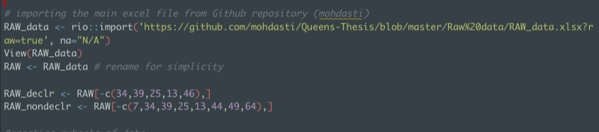
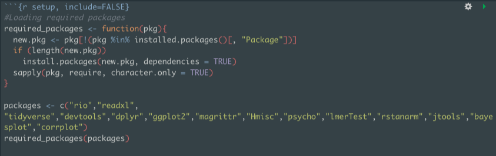

# Today's Presentation

.font180[
- Part I: Workflow
    - a brief description of my data/project
    - data storage — research personnel — infrastructures 
    - data analysis/report packages
- Part II: Critique
    - Efficiency
    - Fidelity
    - Sharing/Reproducibility
]

<style>

.center2 {
  margin: 0;
  position: absolute;
  top: 50%;
  left: 50%;
  -ms-transform: translate(-50%, -50%);
  transform: translate(-50%, -50%);
}


pre.sourceCode {
    max-height: 200px;
    overflow-y: auto;
}


/*
.remark-slide-number {
  position: inherit;
}

.remark-slide-number .progress-bar-container {
  position: absolute;
  bottom: 0;
  height: 4px;
  display: block;
  left: 0;
  right: 0;
}

.remark-slide-number .progress-bar {
  height: 100%;
  background-color: blue;
}
*/
</style>


```{css, echo=FALSE}
# CSS for including pauses in printed PDF output (see bottom of lecture)
@media print {
  .has-continuation {
    display: block !important;
  }
}

```


```{r setup, include=FALSE, cache=TRUE}
options(htmltools.dir.version = FALSE)
library(knitr)
opts_chunk$set(
  fig.align="center",  
  fig.height=4, #fig.width=6,
  # out.width="748px", #out.length="520.75px",
  dpi=300, #fig.path='Figs/',
  cache=T ,#, 
  echo=F #warning=F, message=F
  )
install.packages("hrbrthemes",repos = "http://cran.us.r-project.org")
library(tidyverse)
library(hrbrthemes)
library(fontawesome)

```

---
class: inverse, center, middle

# .font140[a little background — Workflow]

---
# Is the Role of Sleep in Memory Consolidation Overrated?


.font140[
- For this presentation, I go over the declarative memory data analysis only
- 3 experimental condition (NAP, MED, WAKE) — comparison of memory retention across groups

- Word-pair associate task 
  - 60 word-pairs pre-treatment and 60 post-treatment (20 same + 20 novel + 20 recombined)
  - say *YES* if you've seen the exact pair before

]
---
# Workflow cont. — other info

.font140[
- Overall analysis pipeline
  - confusion matrix for their response
    - $Hit$, $Miss$, $False Alarm$, $Correct Rejection$
  - Geometric-mean (G-Mean) as a measure of performance of each participant
    - higher G-Mean $\Longrightarrow$ superior consolidation
    
- participants' responses were recorded on paper (series of 0s and 1s)
  - raw values inserted in a Microsoft Excel spreadsheet
  - *Hit*, *Miss*, *False Alarm*, and *Correct Rejection* values calculated by a simple formula
- One graduate student (myself) and two RAs were responsible for collecting data
- Excel sheet imported to the RStudio program for further analyses + write up in RMarkdown
]
---
class: inverse, center, middle

# .font140[Critique]

---
# Efficiency

.font140[
- data collection improvements
  - employing a simple psychtoolbox code
    - higher accuracy in data collection
    - minimizing error in data entry process
    - facilitation of data transfer to other programs
    - dropping the Microsoft Excel from workflow (?)
- data analysis improvements
  - creating additional cutoff measures to avoid hardcoding
]
.pull-leftt[
```{r, echo=FALSE, out.width="100%"}
 
```
]
---
# Efficiency cont.

### automating the installation of new required packages and preventing reinstalling those already installed.
```{r, echo=FALSE, out.width="100%"}
 
```

---
# Fidelity

.font140[
- Sanity check!
  - plotting the distribution of results
- a clear and consistent naming convention
- if required to drop values ±2 S.D, then clearly annotate
- for the sake of consistency, stick with Tidyverse package
  - admittedly, it may not be 100% possible
- pivoting the datasets
  - at the time, I re-entered the data manually in a Excel spreadsheet and imported in R!
  - 🤦🤦
]

---
# Sharing/Reproducibility

.font140[
- my original raw data were posted in OSF and my GitHub repository
- I also wrote the whole dissertation in RMarkdown and uploaded that in my GitHub Repo
  - theoretically, it should be reproducible!
- Something I recently noticed: some packages I used have changed...
  - ideally, using stable packages and avoiding "dev" packages (?)
]

---

class: inverse, center, middle

# .font140[ Thank You]


<html><div style='float:left'></div><hr color='#EB811B' size=1px width=100%></html>

.font190[
<mdast003@ucr.edu>
]
```{r gen_pdf, include = FALSE, cache = FALSE, eval = TRUE}
pagedown::chrome_print("01_slides.html", output = "01_slides.pdf")
```